# SD-DC — an agentic stack for data centre design

<p align="center">
  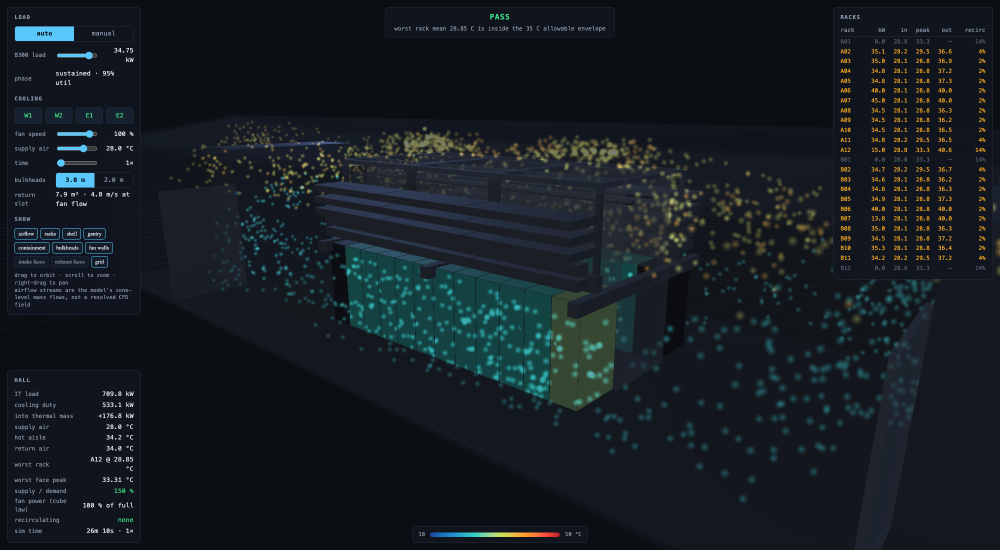
</p>
<p align="center"><sub>The AU01 hall at 709.8&nbsp;kW sustained, solved faster than real time and streamed to a browser. Cyan is supply into the rack faces, amber is the exhaust plume. Worst rack 28.85&nbsp;°C against a 35&nbsp;°C envelope — <a href="https://au01-twin.dametech.net/">au01-twin.dametech.net</a></sub></p>

A data centre is sized, routed, costed and simulated by a dozen different tools
that do not speak to each other, and a human carries numbers between them. This
repository is the bet that the whole loop can be closed by an agent instead —
that **sizing, routing, costing, drawing and simulating are all just tool calls**
over one machine-readable model of the building.

The unit of work is not a drawing. It is a **catalogue entry**, a **sizing
calculation**, or a **simulation** — each one machine-readable, each one carrying
its own provenance, each one verifiable by execution. An agent can select a
cable, route a pipe, size a tray, and predict a hall's thermals without a human
transcribing anything from a PDF.

---

## The design loop

The target is a loop with no human in the middle of it. A brief goes in; a model
of the building comes out; every engineering decision inside it was made by a
tool that can show its working, and checked by running the thing.

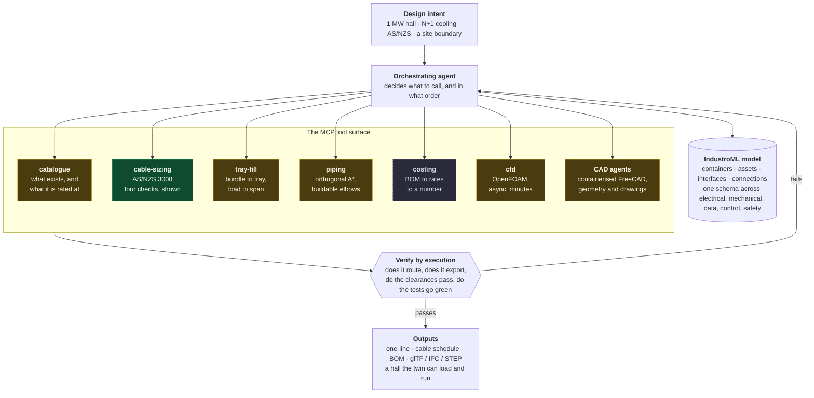

<sub>**Green** is built, tested and in use today. **Amber** exists as code but is
not yet wrapped as a service an agent can call. **Grey** is designed and not
written. The state table below says exactly which is which, with numbers.</sub>

### Why this can work at all

Three properties make an engineering domain tractable to an agent, and this
repository is an argument that data centres have all three.

**Every answer is checkable.** A cable size is right or wrong against a
standard. A pipe route either closes or it does not. A layout either meets
clearances or it does not. `python3 test_cable_sizing.py` is 158 checks that run
in under a second — which makes it a reward signal as much as a test suite.

**The inputs are public and finite.** Vendors publish datasheets. Standards
publish methodology. The set of things that go in a data hall is a few hundred
product families, not a long tail.

**Nothing is real-time.** A design takes weeks. An agent that takes four minutes
and a hundred tool calls to size a feeder run is still a thousand times faster
than the meeting it replaces.

### The model in the middle: IndustroML

Tools that pass each other files are a pipeline. Tools that read and write one
model are a design system. The model is
**[IndustroML](https://github.com/sinkers/industroml)** — a separate public
repository, and the named interchange format for this stack.

It describes a site as four lists: **containers** (site, building, room, rack,
tray, conduit), **assets** (transformer, switchboard, pump, CDU, PLC, sensor),
**interfaces** (the ports on those assets, each with a domain and a medium), and
**connections** (cable, pipe, data link, I/O link, with an optional route
through named trays and racks).

That last field is the one that matters here. A connection that carries
`route: [TRAY-A1, TRAY-A2, RISER-3]` is simultaneously an electrical fact, a
geometric fact and a quantity on a bill of materials. It is what lets
`cable-sizing` hand a length to `costing` and a bundle to `tray-fill` without
anybody inventing a second format in between.

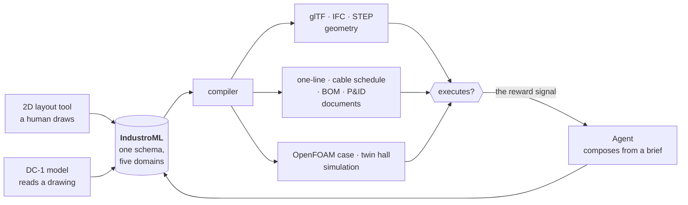

Three authors, one schema, one compiler. Which means every hall a human draws by
hand is a verified training sample for the model that learns to draw them, and
the compiler is the grader. `PLAN.md` §0.2 sets this out; the instruction there
is blunt — *do not invent a second IR*.

### Containerised CAD agents

FreeCAD is the geometry kernel, and it is the part that does not fit the rest of
the pattern. It is heavyweight, stateful, GUI-shaped, and a scripted session can
take minutes. So it does not sit in-process behind an MCP tool. It sits behind a
job queue, in a container, and the agent talks to a fleet of them.

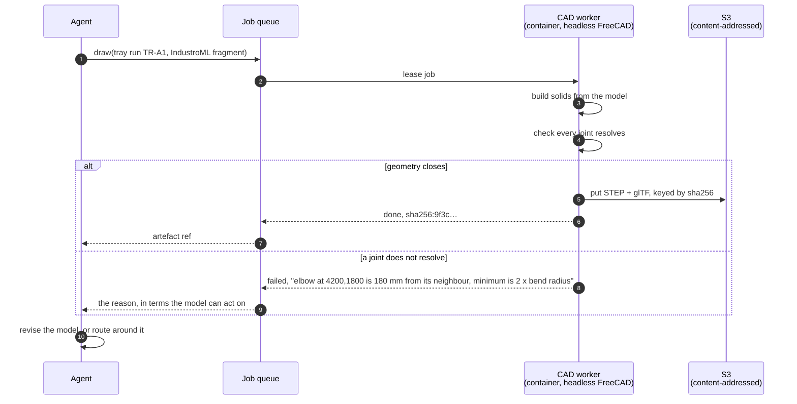

The failure branch is the point. A CAD worker that answers *"no, and here is the
clearance that was violated"* is a tool an agent can use. One that silently emits
geometry which cannot be built is worse than nothing, because the error surfaces
on site.

`vm-setup/` is the working version of this today: a headless FreeCAD VM with an
XML-RPC server and an MCP bridge. The container fleet, the queue and the
content-addressed artefact store are the next step; the S3 layout it writes into
already exists and is described below.

### Costing

The cheapest thing to add and the last one built, because it needs everything
else first. A costed design is the only kind a client believes, and it is also
the objective function the agent actually optimises against.

Once a connection carries a sized conductor, a routed length and a tray
allocation, the bill of materials is a projection of the model rather than a
document somebody assembles. Rates go in a private table for the same reason
vendor datasheets do — see *Code open, data private* below.

The interesting consequence is that **a layout becomes differentiable in
dollars**. Move a switchboard eight metres and the feeder shortens, the volt
drop falls, a cable size drops with it, the tray load changes and the number
moves. That is an optimisation loop, and it is the thing none of this is close
enough to yet to claim.

---

## What is actually built today

The vision above is the destination. This is the odometer.

| Component | Layer | What it does | State |
|---|---|---|---|
| [`cable-sizing/`](cable-sizing/) | Engineering | AS/NZS 3008 cable sizing with a full audit trail. REST API, MCP over stdio **and HTTP**, browser UI | **Mature** — 308 checks |
| [`digital-twin/`](digital-twin/) | Simulation | Real-time AU01 hall thermals, calibrated against the CFD, streamed to a browser and Unreal | **Deployed** — 119 tests |
| [`cfd-cabinet-cooling/`](cfd-cabinet-cooling/) | Simulation | OpenFOAM: does a fan wall keep a 30 kW cabinet inside ASHRAE limits? | Working |
| [`liquid-twin/`](liquid-twin/) | Simulation | Two-loop liquid cooling — DLC cold plates to CDU to chillers, as a pressure-driven hydraulic network | Phase 1 of 6 — 137 tests |
| [`cables/`](cables/) | Catalogue | Nexans Australia cable catalogue — 3 families, 40 sizes, with OD, weight, bend radius, pulling tension and impedance | Working |
| [`cable-tray-ezystrut/`](cable-tray-ezystrut/) | Catalogue | Ezystrut tray systems — 5 families (ET5, ET3, ET, CT, NEMA3), datasheets, STEP models, joining rules | Working |
| [`piping/`](piping/) | Engineering | Orthogonal pipe routing with A* obstacle avoidance, generating solid FreeCAD geometry | Working, 3/5 scenarios pass |
| [`cooling-model/`](cooling-model/) | Engineering | Parametric cooling plant and pump skid geometry, exported to STEP/OBJ | Working |
| [`vm-setup/`](vm-setup/) | Infrastructure | Headless FreeCAD VM, XML-RPC server, MCP bridge | Working |
| [`spec-exchange/`](spec-exchange/) | Process | Questions to the standards owner and their answers, with values held privately | Working |
| [IndustroML](https://github.com/sinkers/industroml) | Model | Cross-domain site schema, validator, Mermaid/PNG generator, Next.js editor | Separate repo — v0.1 |
| `dc-model` | Catalogue | Private repo — DC-1 training corpus and extraction platform | External |
| `sddc-collector` | Catalogue | Separate repo — polite crawler, content-addressed store | External |
| `layout/` | Engineering | The spatial solver that composes all of the above into a hall | **Not built** |
| `costing/` | Engineering | BOM to rates to a number | **Not built** |

```bash
./run-tests.sh          # every suite: 308 + 119 + 137, all green
```

### Honest scoreboard

- **Cable sizing is real.** Four standards, four checks, three front ends over
  one service layer, an audit trail on every answer, and it is registered as an
  MCP server in this project today. It is the template every other component is
  meant to copy.
- **The twins are real and one of them is deployed.** CFD calibrates a reduced
  model that runs faster than real time. That pattern — slow ground truth,
  fast surrogate — is the only way simulation fits inside a design loop.
- **The tool surface is not yet a surface.** One component speaks MCP. The rest
  are imports and relative paths. `PLAN.md` §1a is the plan to fix that, and
  until it lands the loop at the top of this page is a sketch with one real box
  in it.
- **There is no layout engine.** The thing that turns a brief into a placed hall
  does not exist. Components exist; composition does not.
- **Nothing is costed.** Not a line of it.

---

## Purpose and use

**This is a private study and research project. It is not for commercial use.**

The toolkit exists to explore whether data centre design can be driven
programmatically by AI agents — sizing, routing, and simulating from
machine-readable equipment data rather than by hand in CAD.

### Code open, data private

The split is deliberate and it runs through the whole system:

| | Public | Private |
|---|---|---|
| Engines, schemas, tests, docs | `sd-dc`, `industroml` | |
| Collected vendor documents | | S3 `catalogue/` |
| Standards tables | | S3 `standards/` |
| Source registries and crawlers | | `sddc-collector` |
| Training corpus and DC-1 | | `dc-model` |
| Installed rates for costing | | (planned, private) |

This is the posture the established AS/NZS 3008 calculators already take.
Verified 2026-09-04: Tricab's client-side JavaScript contains **no numeric
tables at all** — it posts to a server endpoint — and jCalc's public page cites
table numbers 21 times while publishing none of their contents. The calculator
holds the data; the user gets an answer.

It also makes vendor agreements tractable. "We pull your data and use it, we do
not republish it" is a workable conversation, and it is verifiable rather than a
promise: `redistribute: false` is a field on every source and is stamped into the
provenance of every collected object.

And it is what allows a **single-vendor build** — a Delta-only tool, say — from
the same codebase, with only that vendor's catalogue. See `PLAN.md` §0.1a.

### What that means for vendor data

Equipment catalogues are built from manufacturer documentation, collected for
private study under that purpose. Two rules follow, and both are enforced rather
than merely stated:

- **Documents are never redistributed.** No vendor datasheet, brochure or CAD
  file is published from this repository. They are fetched to a private bucket.
  `catalogue/sources.yaml` records `redistribute: false` per source, and the
  provenance sidecar on every collected object carries it too, so a consumer
  knows the terms without going back to the registry.
- **Transcribed facts are kept, documents are not.** `cable_catalog.json` and
  `tray_catalogue.json` hold dimensions, ratings and load data read out of those
  documents. A dimension is a fact; the document is someone's copyright work.
  Nothing in the code reads the source documents.

Collection is polite by construction: robots.txt and `Content-Signal` are
honoured, rates are deliberately slow, and a machine-readable AI-training refusal
is a hard stop. See `sddc-collector`.

### If you are not us

**A statement of purpose here is not a licence.** It records what this project
is; it does not grant you anything, and it does not change what any vendor's
terms permit.

If you clone this and use it commercially, the vendor data in it is not licensed
to you. Check each source's terms — `catalogue/sources.yaml` records the stance
and quotes the clause — and obtain your own permission. Several vendors publish a
route: Korvest, for instance, offer a Copyright Release Form.

---

## The four layers

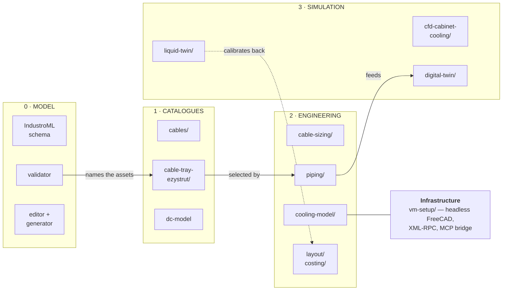

Layer 0 answers *what is this building made of*. Layer 1 answers *what can I
buy*. Layer 2 answers *what should I use, and does it comply*. Layer 3 answers
*what happens when I switch it on*.

---

## 1. Catalogues

Catalogues are **data, not code** — JSON files that an engine reads. Splitting
them this way means a catalogue can be corrected without touching a calculation,
and a calculation can be validated without a live vendor site.

### `cables/`

Nexans Australia, 16 cable types documented in markdown, 3 with full current
ratings machine-readable in `cable_catalog.json`:

- `XLPE_SDI_CU`, `XLPE_SDI_AL` — single-core XLPE, copper and aluminium
- `LFH_SINGLE` — low fire hazard, 110 °C

Each size carries outer diameter, weight, installation and installed bend radius,
maximum pulling tension, and (for copper) AC/DC resistance and reactance. The
geometry fields exist so that a sizing result feeds straight into tray fill,
tray loading and routing constraints.

### `cable-tray-ezystrut/`

<p align="center">
  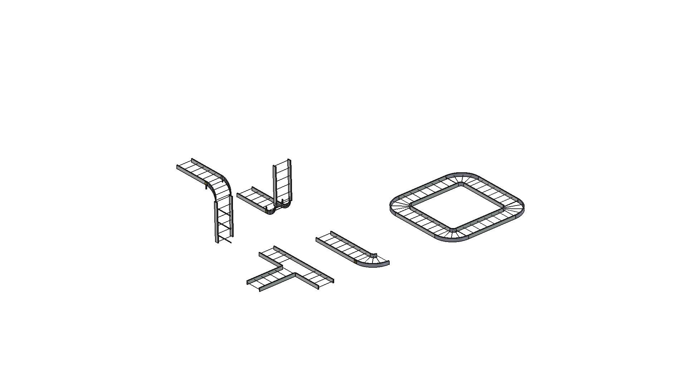
</p>
<p align="center"><sub>Generated fittings, not drawn ones — bend, riser, tee, reducer, and a closed circuit that proves the joints resolve</sub></p>

Five tray families with load/span data, plus PDF datasheets, STEP models of
brackets and trapezes, and `JOINING_RULES.md` — the rules that make a generated
tray run buildable rather than merely drawn. `cable_tray_router.py` generates
routes; `joint_reference.html` and `verification/` are generated evidence that
the joints resolve.

### `dc-model/`

The bet that the scarce asset is not data but **verified** data. An acquisition
and extraction platform that turns vendor documentation and real Australian DA
submissions into structured geometry:

- **Acquisition** — polite crawler honouring robots and `Content-Signal`, with
  per-host token buckets, conditional GET, a SQLite frontier and a
  content-addressed S3 store
- **Corpus** — 1,215 documents, SHA-256 addressed
- **Extraction** — vector geometry recovered to DXF plus a JSON sidecar of
  positioned text spans. On vector pages, recall median 95.0%
- **Evals** — two suites, `drawing-read` and `drawing-locate`

`RESUME.md` is the hand-off document and `DESIGN.md` sets out the longer-term
aim: a model that emits *geometry programs* rather than pictures, so output is
verifiable by execution.

---

## 2. Engineering

### `cable-sizing/`

The most developed component, and the template for the rest. Given a source, a
load, a route length and an installation condition, it returns the smallest
compliant cable with every check shown.

<p align="center">
  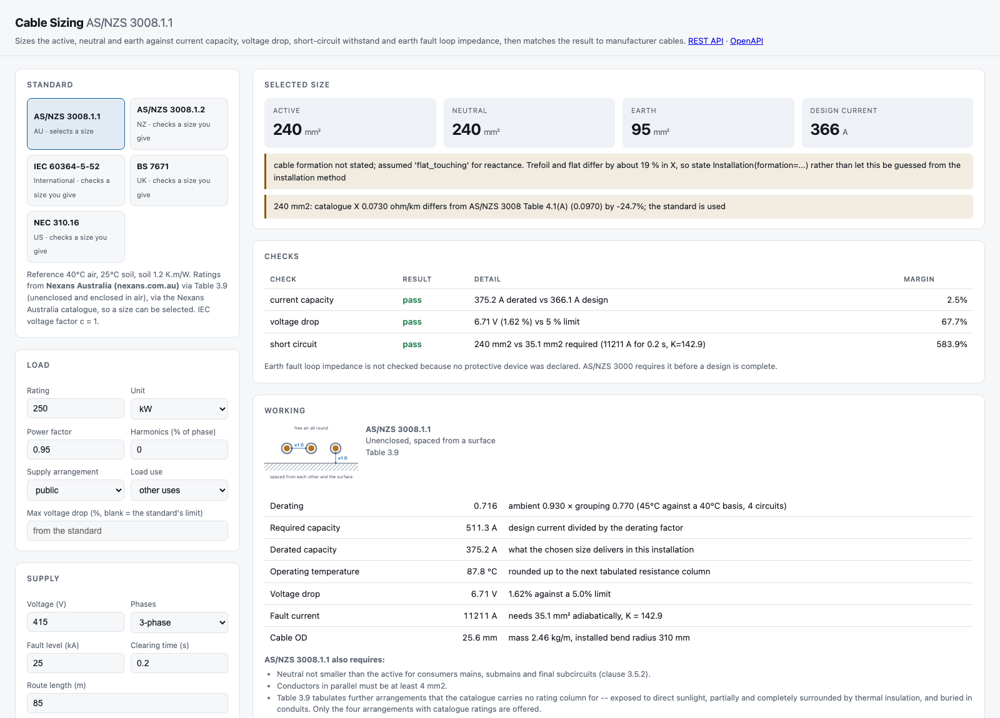
</p>
<p align="center"><sub>Not just an answer. The derating factors, the operating temperature, the adiabatic check, the installation arrangement that set the rating — and two warnings, including the one saying the formation was guessed.</sub></p>

Four checks in order: current-carrying capacity after derating, voltage drop,
short-circuit withstand, earth fault loop impedance.

The warnings are the part worth arguing for. *"Cable formation not stated;
assumed flat_touching for reactance. Trefoil and flat differ by about 19 % in
X"* is the engine refusing to let a guess pass as a result. So is *"catalogue X
0.0730 ohm/km differs from AS/NZS 3008 Table 4.1(A) by −24.7 %; the standard is
used"* — it took the conservative source and said which one it took.

```python
from cable_sizing import Source, Load, Installation, size_feeder

result = size_feeder(
    Source("MSB-1", voltage_v=415, fault_level_ka=25, clearing_time_s=0.2),
    Load("PDU-A1", kw=250, power_factor=0.95, harmonic_content_pct=55),
    route_length_m=85,
    install=Installation(method="trefoil", ambient_c=45, n_circuits=4),
)
print(result.summary())
```

Standards covered: AS/NZS 3008.1.1 and 1.2, with AS/NZS 3000:2018 for voltage
drop limits, minimum sizes, neutral sizing and conduit fill; IEC 60364-5-52,
BS 7671 and NEC 310.16 for check-only operation.

Three front ends over one service layer, so a calculation cannot drift between
a browser and an agent:

| Front end | Entry point |
|---|---|
| REST + HTML | `server.py`, described by `openapi.py` |
| MCP over stdio | `mcp_server.py` — 5 tools, 3 resources |
| MCP over HTTP | `http_mcp_server.py` — same dispatch, for hosted clients |
| Direct | `import cable_sizing` |

The HTTP transport is the one that matters for the stack above: a hosted agent
cannot spawn a subprocess, so it cannot use stdio. Dispatch is `mcp_server.handle`
either way — **stdio and HTTP cannot give different answers to the same
question, because there is only one implementation of the answer.**

The five tools an agent sees:

| Tool | What it does |
|---|---|
| `size_cable` | Select the smallest conductor that passes all four checks |
| `check_cable_size` | Check a size you nominate, under any of the four standards |
| `list_standards` | The four profiles, their ambients, soil models and methods |
| `list_cable_types` | Cable families with conductor, insulation, voltage, temperature |
| `get_installation_diagram` | An SVG of the arrangement that sets the rating — spacing, formation, touching or spaced |

308 checks across two suites (`test_cable_sizing.py`, `test_api.py`), plus a
credential-free synthetic smoke suite that proves the code assembles without the
licensed tables present.

### `piping/`

<p align="center">
  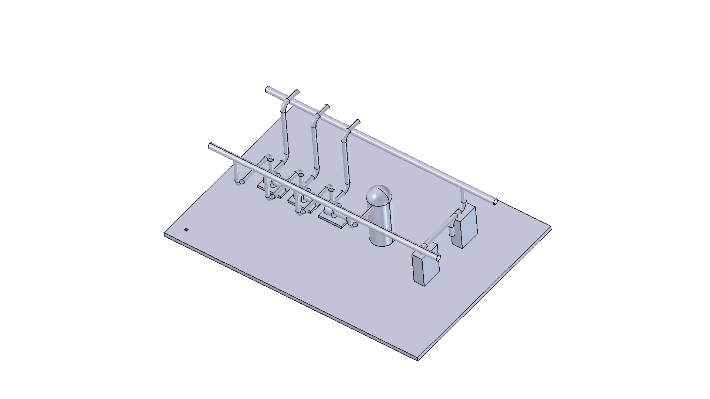
</p>
<p align="center"><sub>Solid geometry, generated from a routing solution — not a centreline, and not drawn by hand</sub></p>

Routes pipe between plant nozzles using only 90° elbows, on a grid, avoiding
obstacles via A*. Generates solid geometry, not centrelines, and validates that
consecutive parts actually meet. The minimum-segment-length constraint is
enforced because two elbows closer than 2×bend radius cannot be built.

`routing_report.html` is honest about the current state: 5 scenarios, 3 pass.
The two failures are the interesting ones — they are the cases where a route
exists geometrically but cannot be assembled, which is exactly the class of
error a CAD agent has to report rather than swallow.

### `cooling-model/`

Parametric cooling plant and pump skid generation, exported to STEP and OBJ for
downstream use.

---

## 3. Simulation

### `cfd-cabinet-cooling/`

<p align="center">
  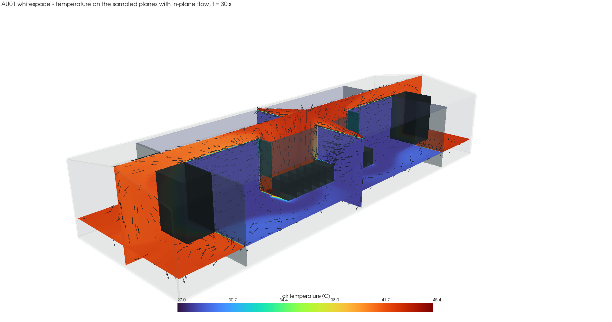
  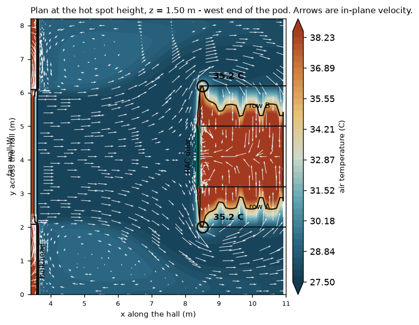
</p>
<p align="center"><sub>Ground truth. The right-hand plan is the answer to the only question that matters: where is it hottest, and by how much</sub></p>

An OpenFOAM case answering one question: does this fan wall deliver enough cold
air to keep a 30 kW cabinet inside ASHRAE limits, and what happens when it
doesn't? A 600 mm cabinet pitch of a contained row, modelled as a slice through
an effectively infinite row with symmetry planes.

Everything runs in Docker. `run.sh` meshes and solves; `plot_metrics.py` gives a
PASS/FAIL verdict with convergence plots.

Generated reports cover the baseline case, the AU01 hall and a 3D verification
record. `FINDINGS-AU01.md` grades every input by confidence, and is explicit
that the server air-side ΔT is assumed rather than published — the weakest link
in the study.

### `digital-twin/`

A reduced-order physics model of the AU01 hall, calibrated against the OpenFOAM
CFD, running faster than real time and streaming state to a browser and an
Unreal scene. Each visitor gets their own hall.

**Live: <https://au01-twin.dametech.net/>**

Two drive modes: manual load, or a synthetic transformer training run with ramp,
sustained grind, checkpoint dips, eval pauses, stragglers and restarts. Three
scenarios ship: `training_run`, `n_minus_one`, `west_fanwall_trip`.

This is the pattern worth repeating — CFD is too slow to sit inside a design
loop, so it becomes the ground truth that calibrates something fast enough to.

### `liquid-twin/`

<p align="center">
  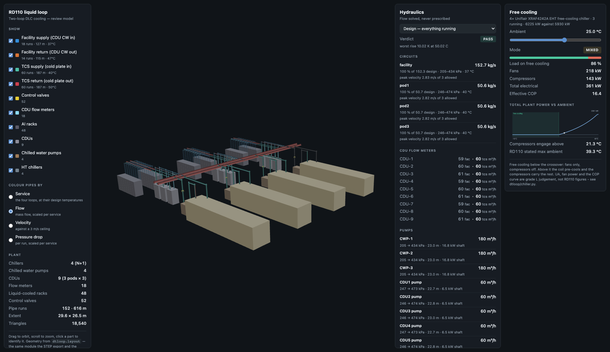
</p>
<p align="center"><sub>The RD110 loop coloured by <b>service</b> — the four loops at their design temperatures</sub></p>

<p align="center">
  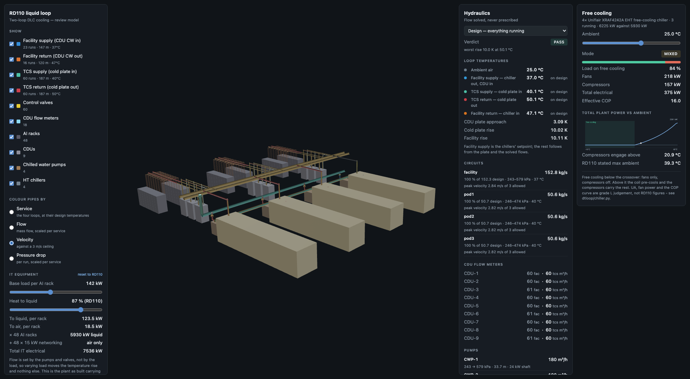
</p>
<p align="center"><sub>The same network, recoloured by <b>velocity</b> against a 3&nbsp;m/s ceiling. Peak 2.84&nbsp;m/s on the facility circuit — the headers run close to the limit, the branches do not. Nothing here was drawn; it is what the solver found — <a href="https://au01-twin.dametech.net/loop/">au01-twin.dametech.net/loop/</a></sub></p>

The other half of the cooling story: DLC cold plates to CDU to chillers, the
loop the air twin explicitly does not model. Reducing each heat exchanger to a
couple of numbers leaves no flow field to resolve, so this is not CFD at all —
it is a pressure-driven hydraulic network plus thermal transport, solved in
milliseconds.

The governing decision is that **flow is an output, never an input**. Shut one
of four identical rack branches and total flow falls 23.7 %, not the 25 % that
was removed, because the pump rides up its curve while the three survivors each
gain 1.6 %. Nothing models that; it falls out of solving the network, and it is
why the air side's prescribed-flow approach could not answer the question.

Building the RD110 loop also settled a question the brochure did not: at 21.3 °C
ambient the plant stops being dry coolers and the compressors engage. The model
found it; nobody had written it down.

Phase 1 of 6, and ahead of the plan in one place: the hydraulic core is built
and tested at 137 checks, and the viewer and a free-cooling chiller model landed
early because drawing the network was the fastest way to find three mistakes in
it. Thermal transport and controls are not built. The chiller curve's shape is
right and its constants are placeholders — `dtloop/chiller.py` says so in as many
words — and the parameter loader raises rather than substituting a default for
anything still pending.

---

## 4. The model — IndustroML

**Repository: <https://github.com/sinkers/industroml>**

The schema everything above is meant to read and write. It is deliberately not
part of this repository: a format that only one toolkit can parse is not a
format, and IndustroML describes industrial sites generally — water treatment
plants and process halls as readily as data centres.

```yaml
# a fragment: one feeder, fully described
assets:
  - id: MSB1
    name: Main Switchboard 1600A
    domain: electrical
    kind: switchboard
    container: BLD-MCC
    attributes: { voltage_v: 415, current_a: 1600 }

interfaces:
  - id: MSB1.FEED-MCC1
    asset: MSB1
    domain: electrical
    medium: ac_lv_3ph
    attributes: { voltage_v: 415, current_a: 800 }

connections:
  - id: C-MSB1-MCC1
    type: cable
    from: MSB1.FEED-MCC1
    to: MCC1.IN
    route: [TRAY-A1, TRAY-A2, RISER-3]      # <- the field that joins the domains
    attributes: { csa_mm2: 300, cores: 4, insulation: XLPE, length_m: 85 }
```

Five domains — electrical, mechanical, data, control, safety — with 150-odd
asset kinds, 14 media and four connection types, all closed enumerations so a
validator can reject a typo rather than passing it downstream. Containers nest.
Interfaces are scoped to their asset (`ASSET.PORT`), which is what makes a
connection unambiguous without a positional convention.

What it ships today: a JSON Schema, a referential validator, a generator that
emits Mermaid, PNG, an HTML tree viewer and node/edge JSON, a master catalogue
with icon mappings across all five domains, and a Next.js editor with a filtered
tree view.

What it does not do yet is carry geometry. Poses, extents and routes-as-polylines
are the gap between a model that describes a plant and one that compiles to a
building. That is the work.

---

## Where the large data lives

Meshes and converged CFD solutions are too large for git and are needed by
cluster workers, so they live in S3:

```
s3://$SDDC_ARTIFACTS_BUCKET/
├── cfd/<case>/<git-sha>/     mesh + solution fields + manifest.json
└── geometry/<sha256>/        STL/STEP exports, content-addressed
```

Fetch CFD cases with `cfd-cabinet-cooling/tools/data_pull.sh`, push with
`data_push.sh`. Fetch the licensed standards tables with
`tools/data_pull_standards.sh` — you need your own licensed copy of AS/NZS 3008
and AS/NZS 3000 to use those legitimately.
Workers get read-only access via `tools/iam-worker-readonly.json`.

CFD is keyed by **case + git sha**, because a solution only means anything
against the case dictionaries that produced it. `data_push.sh` refuses to file a
solution under a sha whose dictionaries are modified, and the manifest records
`dictionaries_dirty` so a consumer can tell. Geometry is small and dedupes, so it
gets content-addressing instead — which is also the store the containerised CAD
workers write into.

## Working practice

Four conventions hold across the repo. They exist because an agent consuming
this data cannot tell a measured number from a plausible one unless we say so.

**1. Provenance is a field, not a comment.** Reference data carries a `verified`
flag and a source string. `cable-sizing/reference_tables.json` has 9 verified
tables and 5 unverified; `as3008.verification_report()` prints the status of
each, and the test suite refuses to let a table be marked verified while it still
holds placeholder provenance. `cable-tray-ezystrut/tray_catalogue.json` and
`cable-sizing/as3008_ratings.json` carry the same fields.

**2. Say which numbers are quotable.** `dc-model/RESUME.md` lists quotable
measurements and, separately, numbers that *look* publishable and are wrong, with
the reason. Cheaper than rediscovering it.

**3. Capture records are kept.** When a standard or datasheet is read,
`EXTRACTED-TABLES.md`-style records note what was captured, what was deliberately
not encoded and why, and what remains outstanding. `spec-exchange/` extends this
to questions put to the standard's owner: the question is public, the answer's
values are not.

**4. Verify by execution.** Does the script run, does STEP export, does the pipe
route close, do the clearances pass, do the tests go green. This is what makes
the output trustworthy to an agent, and it is also a reward signal.

**5. Degrade loudly, never silently.** If a service is unreachable, the caller
reports "cable sizing unavailable, N connections unsized" and emits that into the
model. It does not quietly produce a layout with no cables and it does not
substitute a guess. Same principle as `verified: false` — the absence of an
answer is information.

---

## Getting started

Most components are standard-library Python 3 and need nothing installed.

```bash
./run-tests.sh                      # every suite in the repo

# Cable sizing — no dependencies
cd cable-sizing
python3 test_cable_sizing.py        # 158 checks
python3 server.py                   # REST + UI on localhost
python3 build_status.py && open STATUS.html

# CFD — needs Docker, plus matplotlib on the host
cd cfd-cabinet-cooling
./run.sh && ./plot_metrics.py case

# Digital twin — numpy + websockets
cd digital-twin
pip install -e '.[dev]'

# Liquid twin
cd liquid-twin
pip install -e '.[dev]' && python3 -m pytest loop/tests -q

# FreeCAD geometry (piping, cooling-model, tray models)
# needs the headless FreeCAD VM
cd vm-setup && cat INSTALL.md
```

### Giving an agent the tools

One component speaks MCP today, over two transports.

```bash
# stdio — a local client that can spawn a process
claude mcp add cable-sizing -- python3 "$PWD/cable-sizing/mcp_server.py"

# HTTP — a hosted client that cannot
python3 cable-sizing/http_mcp_server.py           # http://127.0.0.1:8766/mcp
MCP_TOKEN=secret python3 cable-sizing/http_mcp_server.py
```

See `cable-sizing/MCP.md` for the full surface. The aggregator server that fans
out to every component — one registration, the whole toolkit — is designed in
`PLAN.md` §1a and not written.

---

## Known gaps

The distance between the loop at the top of this page and the repository below it:

- **No layout engine.** `SPEC.md` describes a spatial solver that takes a
  `DCSpec` and places equipment. Components exist; the thing that composes them
  into a whole data centre does not. This is the single biggest gap.
- **No costing.** Not started. Which means there is no objective function, which
  means nothing optimises.
- **Components are not services.** `cable-sizing` reads `../cables/cable_catalog.json`;
  `digital-twin` reads `../cfd-cabinet-cooling/geometry/`. Those relative paths
  only resolve inside a monorepo checkout, so no component can be deployed or
  versioned alone. `PLAN.md` §1a is the fix.
- **The CAD fleet is one VM.** `vm-setup/` works. A queue, a container image and
  a worker pool do not exist.
- **IndustroML carries no geometry.** No poses, no extents, no polyline routes.
  Until it does, it cannot be compiled to a building.
- **Catalogue coverage is thin against the ambition.** Three cable families and
  five tray families. No generators, UPS, switchgear, transformers, CDUs or racks
  as machine-readable catalogue entries.
- **Cable reactance** is tabulated for one family only; the other 26 of 40 sizes
  fall back to a construction-based nominal.
- **AS/NZS 3000 clause 5.3.3** (earthing conductor sizing) is still unverified,
  and it is the last safety-critical table in `cable-sizing`.
- **`piping/`** fails 2 of its 5 routing scenarios.

`SPEC.md` holds the original architectural vision and [`PLAN.md`](PLAN.md) is the
roadmap — layout engine, equipment catalogue crawlers, and the electrical,
cooling, security and fire views.

---

## Safety

Nothing here is a substitute for a standard or for a chartered engineer. The
sizing engines implement published *methodology* and read manufacturer
catalogues; they do not reproduce copyrighted rating tables, and unverified
reference data is labelled as such. Check `verification_report()` and the
component READMEs before anything is issued for construction.

An agent that sizes a cable is a faster draughtsman, not an engineer. The audit
trail exists so that a human can disagree with it.
