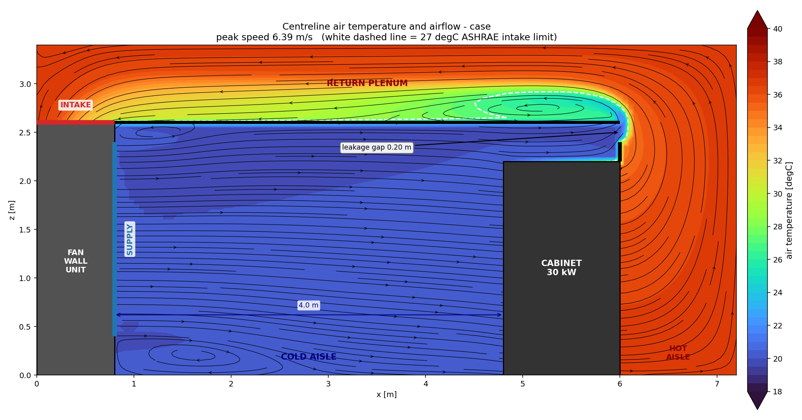

# Cabinet cooling CFD — 30 kW rack in hot-aisle containment

An OpenFOAM case that answers one question: **does this fan wall deliver enough
cold air to keep a 30 kW cabinet within ASHRAE limits, and what happens when it
doesn't?**



Everything runs in Docker. Nothing but Docker and Python 3 with matplotlib is
needed on the host.

**Reports:** [3D report](verification/report-3d.html) (build with
`./build_report_3d.py`) and the 2D sweep viewer (`./build_viewer.py`). Verification
record in [VERIFICATION-3D.md](VERIFICATION-3D.md).

```bash
./run.sh                    # mesh + solve the baseline   (~6 min)
./run.sh --sample           # extract the centreline slice
./plot_metrics.py case      # PASS/FAIL verdict + convergence plots
./plot_slice.py   case      # the picture above
```

---

## What is modelled

A single 600 mm cabinet pitch of a contained row, as a 7.2 × 0.6 × 3.4 m domain
with symmetry planes on both side walls — i.e. a slice through an effectively
infinite row of identical cabinets.

```
  z=3.4  ceiling ______________ RETURN PLENUM ______________
  z=2.6         |intake|########## plenum floor ##########|  |
                |      |                          +------+  |
  z=2.4         | FAN  |                          |cont. |  | HOT
  z=2.2         | WALL |              +-----------+------+  | AISLE
                | UNIT |              |  CABINET  |#####    |
  supply  ==>   |======|  COLD AISLE  |   30 kW   |#####    |
  z=0.0         |______|______________|___________|_________|
              x=0    x=0.8          x=4.8       x=6.0     x=7.2
                     |<--- 4.0 m --->|
```

The fan wall unit is a closed loop through the hall: it discharges cold air
from its face into the cold aisle and draws the air back in through an intake
on **top** of the unit. Hot air leaves the contained hot aisle upward into the
return plenum, tracks back over the cold aisle and drops into that intake. The
only way it can reach the cold aisle directly is the containment gap.

| Element | Model |
|---|---|
| Fan wall unit | 0.8 m deep × 2.6 m tall solid block, cut out of the mesh by `subsetMesh` |
| Supply | 2.0 × 0.6 m velocity inlet on the unit face at 20 °C |
| Intake | 0.8 × 0.6 m pressure outlet on top of the unit |
| Cold aisle | 4.0 m from the unit face to the cabinet front |
| Cabinet | cell zone with a 30 kW heat source and a server-fan momentum source; no rack geometry is resolved |
| Containment | zero-thickness adiabatic baffles: plenum floor, cabinet top, and a panel from the cabinet top to `containmentTopZ` |
| Leakage gap | the deliberate opening between the containment top and the plenum floor |
| Return plenum | 0.8 m deep void above the plenum floor, carrying hot air back to the intake |

Solver is `buoyantSimpleFoam` (steady, compressible, buoyant) with k-ω SST on a
uniform 50 mm mesh of 107,520 cells.

### Why there is a leakage gap

This is the single most important modelling decision in the case, so it is worth
stating plainly.

If the containment were perfectly sealed, the servers could only ever draw air
that had just come from the fan wall. The intake temperature would equal the
supply temperature by construction, every run would pass, and there would be
nothing to optimise. The simulation would be answering a question it had assumed
the answer to.

Real containment always leaks — panels stop short of the slab, blanking is
imperfect, doors don't seal. That gap is what makes the airflow balance matter:

- **Fan wall supplies more than the servers draw** → surplus cold air spills
  over the containment into the hot aisle. Safe, but you are paying to move air
  that never removes any heat.
- **Fan wall supplies less than the servers draw** → the servers make up the
  deficit the only way they can, by pulling hot exhaust back over the
  containment into the cold aisle. Intake temperature climbs, and that is the
  failure mode this case is built to show.

The gap height is a parameter (`containmentTopZ`), so "how much is sealing
worth?" is itself a sweep you can run.

### The server fan model

The cabinet is a black box. Air enters the open front face, gains 30 kW, and
leaves the open rear face. A momentum source `S = C·(U_target − U)` on the same
cell zone behaves like constant-speed server fans holding their flow against
whatever back pressure the room presents.

The target is set from the heat load, not guessed:

```
ṁ = Q / (cp · ΔT) = 30000 / (1005 × 15) ≈ 2.0 kg/s
```

over the 0.6 × 2.2 m cabinet free area, giving 1.29 m/s. The converged baseline
reproduces this: 1.847 kg/s through the servers, 16.02 K rise, 29.7 kW carried
away — an energy balance that closes to about 1%.

---

## Tuning it

Every knob lives in one file, `case/system/simulationParameters`:

| Parameter | Default | Meaning |
|---|---|---|
| `fanWallVelocity` | 1.41 | supply discharge velocity [m/s]; **100% of nameplate** server demand (1.69 m³/s). That is the definition used everywhere, including `sweep.sh`. It is ~110% of the *converged* 1.847 kg/s draw, which is where the older "110%" figure came from. |
| `supplyTemp` | 293.15 | supply air temperature [K] |
| `heatLoad` | 30000 | IT load dissipated to air [W] |
| `coldAisleDepth` | 4.0 | unit face to cabinet front [m] |
| `containmentTopZ` | 2.4 | top of the containment panel [m]; 2.6 = fully sealed |
| `cabinetTargetVelocity` | 1.29 | through-cabinet velocity the server fans hold [m/s] |
| `cabinetFanStiffness` | 50 | how hard they hold it [kg/(m³·s)] |

The whole geometry lives there too — `unitDepth`, `unitHeight`, `supplyZ0/Z1`,
`cabinetDepth`, `cabinetHeight`, `hotAisleDepth`, `plenumHeight`, `cellSize`.
Every derived position, the mesh cell counts, the inlet turbulence and the
source coefficients are computed from those with `#eval`, so moving the fan wall
further from the cabinet is a one-line change and everything else follows.

Change a value, then re-run. Geometry values change the mesh, so they need a
full `./run.sh` rather than a solver restart — but `./run.sh` always re-meshes
anyway, so in practice you just re-run.

## Sweeping

```bash
./sweep.sh                                    # default fan wall velocity sweep
./sweep.sh 0.70 0.99 1.41 1.83                # explicit values
PARAM=supplyTemp      ./sweep.sh 291.15 293.15 297.15
PARAM=containmentTopZ ./sweep.sh 2.2 2.6 3.0  # what is sealing worth?
```

Each value gets its own complete case under `runs/<param>_<value>/`, and the
converged metrics are appended to `runs/results.csv`. Because every run is a
full case directory, you can open any of them in ParaView afterwards, or render
its slice with `./plot_slice.py runs/<tag>`.

Then plot the optimisation curve:

```bash
./plot_sweep.py            # runs/sweep.png: intake temp + gap flow vs parameter
```

## Running a 3D row

The case is one case at two scales. `nCabinets 1` with `endClearance 0` is the
original 2D slab, kept as a 2.5-minute regression test; widen `nCabinets` and it
becomes a real 3D row. Verification record: [VERIFICATION-3D.md](VERIFICATION-3D.md).

```bash
# edit case/system/simulationParameters:  nCabinets 4
./run.sh                      # 430k cells, ~9 min on 8 ranks
./plot_row.py case            # per-cabinet intake temps -> case/row.png
```

Per-cabinet cell zones, heat sources, fan sources and metrics are generated by
`make_row_dicts.py`, which `run.sh` calls automatically. To give cabinets
different loads, drop a `case/row_loads.csv` next to the case:

```csv
index,kW
0,45
3,15
```

Any index you leave out keeps `heatLoad`. `plot_row.py` then reports every
cabinet separately and names the worst one.

Note `heatLoad` is **per cabinet**; the dictionaries derive
one `scalarSemiImplicitSource` per cabinet from `row_loads.csv`, each a total over
its own zone. (Earlier versions derived a single `rowHeatLoad = nCabinets x
heatLoad`; that parameter is gone.)

## 3D perspective video

For a perspective view of the whole pod rather than a centreline slice:

```bash
./.venv/bin/python make_3d_video.py case              # perspective.mp4 + .png
./.venv/bin/python make_3d_video.py case --still      # PNG only, much faster
```

It reads the OpenFOAM case directly through VTK, builds the scene - solid
cabinets and fan wall unit, containment and plenum panels, a temperature slice
through the row, the 27 degC isosurface and streamlines seeded across the supply
opening - then orbits a perspective camera and writes H.264. Camera distance is
derived from the field of view, so nothing clips however long the row gets.

This needs the project venv (pyvista + VTK), which is not required for anything
else:

```bash
python3 -m venv .venv && ./.venv/bin/pip install pyvista imageio imageio-ffmpeg
```

## Solved cases live in S3

Meshes and converged solutions are too large for git — 2.4 GB across three cases —
and cluster workers need them. They live in
`s3://$SDDC_ARTIFACTS_BUCKET/cfd/<case>/<git-sha>/`.

```bash
./tools/data_pull.sh --list              # what cases exist
./tools/data_pull.sh case-hall --info    # read the manifest, download nothing
./tools/data_pull.sh case-hall           # fetch the most recent push
./tools/data_pull.sh case-hall <sha>     # fetch a specific one

./tools/data_push.sh case-hall           # push after solving
```

Set `SDDC_ARTIFACTS_BUCKET` to override the bucket.

**Why `<case>/<git-sha>` and not a content hash.** A solution only means anything
against the case dictionaries that produced it. Content-addressing a 600 MB
directory tells you the bytes are unique, which you already knew, and not whether
the fields match the `system/` that generated them.

`data_push.sh` **refuses** to file a solution under a sha whose `system/` or
`constant/` is modified, because that solution would look authoritative and be
wrong. Either commit the dictionaries first, or label it honestly:

```bash
./tools/data_push.sh case-hall <sha>-dirty
```

The manifest records `dictionaries_dirty` either way, so a worker can tell.

`data_pull.sh` reads the manifest before downloading and warns when your checkout
does not match the sha the solution came from. It refuses to pull a case with no
manifest at all.

Pushed: mesh and solution time directories. Not pushed: `log.*`, `0/`, `0.orig/`,
`postProcessing/`, `uniform/` — regenerable, and they were 60% of the bytes.

## Running on a remote box

See [COMPUTE-OPTIONS.md](COMPUTE-OPTIONS.md) for the measured case against GPUs
and for instance recommendations. To use a remote Linux box:

```bash
./remote/provision-openfoam.sh ubuntu@HOST ~/.ssh/key   # idempotent, ~10 min cold
./remote/run-remote.sh         ubuntu@HOST ~/.ssh/key   # sync, solve, sync back
```

Both are written for ephemeral/Spot instances: the provisioner is safe to re-run,
waits out `unattended-upgrades` dpkg locks, and runs detached so a dropped SSH
connection cannot abort a half-finished apt transaction.

## Animation

This case is **steady-state**: it converges to one final flow field, so there is
no physical time axis to animate. What is worth animating is the design
parameter — the flow field sweeping from under-supplied and recirculating
through to over-supplied and bypassing:

```bash
./make_animation.py        # runs/sweep.mp4 + runs/sweep.gif
```

Each frame is one converged run, captioned with its intake temperature, gap flow
direction and verdict, and the loop ping-pongs so the transition reads in both
directions. Open `runs/sweep.mp4` in any player, or drop `runs/sweep.gif` into a
doc or chat.

For a browser-viewable page with the animation, the results table and the
optimisation curve all embedded in one self-contained file:

```bash
./build_viewer.py          # runs/viewer.html - open it directly, no server needed
```

If you want a genuine **time-resolved** animation — cold-start warm-up, a fan
failure, or a cooling outage — that needs a transient solver
(`buoyantPimpleFoam`) rather than `buoyantSimpleFoam`, writing every fraction of
a second and animating time directories in ParaView. That is a different and
considerably more expensive run; see "Limitations".

Each run keeps its full field data and its decomposed copy, so a six-point sweep
is roughly 330 MB. Once you have the CSV and the figures, the decomposed copies
are redundant:

```bash
rm -rf runs/*/processor*    # ~30 MB per run, safe: results are reconstructed
```

## Reading the result

`plot_metrics.py` prints the verdict and writes `metrics.png` (convergence of
intake/exhaust temperature, the two mass flows, and the gap flow). The headline
number is the mass of air entering the servers and its temperature:

- **PASS** — mean intake ≤ 27 °C, the ASHRAE TC9.9 class A1 recommended limit
- **MARGINAL** — mean intake passes but the worst-case intake exceeds the 32 °C
  allowable limit
- **FAIL** — mean intake above 27 °C

`plot_metrics.py` exits non-zero on anything other than a clean PASS, so it can
be used as a regression gate in a script.

The `containmentGapFlow` sign tells you *why*:

| Sign | Meaning |
|---|---|
| `+` | cold air bypassing into the hot aisle — oversupplied, wasting fan energy |
| `−` | hot air recirculating into the cold aisle — undersupplied, this is what causes a FAIL |

`plot_slice.py` renders the centreline temperature field with streamlines and a
white dashed 27 °C isotherm on a fixed 18–40 °C scale, so runs are directly
comparable by eye. See `paraview/views.md` for the interactive 3D equivalent.

---

## Results

Full write-up in [RESULTS.md](RESULTS.md). The headlines from a six-point fan
wall sweep:

- **The baseline cools the cabinet.** At 1.41 m/s the servers ingest 20.2 °C air
  against a 27 °C limit, and the containment holds.
- **The design threshold is the airflow balance point**, 1.29 m/s, where supply
  exactly equals what the servers draw and gap flow crosses zero.
- **Peak intake temperature is very nearly binary** — roughly exhaust
  temperature or roughly supply temperature, thrown by the *sign* of the
  containment gap flow. Across the three failing runs the mean slides gently
  (28.9 → 22.4 °C) while the peak barely moves (37.7 → 36.6 °C), then collapses
  to 20.2 °C the moment gap flow turns positive.
- **So mean intake alone will mislead you.** At 1.15 m/s the mean reads a
  comfortable 22.4 °C while the top of the rack ingests 36.6 °C. Always read
  `cabinetInletTmax` next to the mean.
- **Oversupply buys nothing.** 1.83 m/s is thermally identical to 1.41 m/s and
  costs roughly 2.2× the fan power.

---

## Verification performed

- `checkMesh` passes with zero non-orthogonality and max skewness ~1e-13.
- Patch and zone face counts match the geometry exactly (supply 480 faces =
  1.20 m², intake 192 = 0.48 m², cabinet face 528 = 1.32 m², gap 48 = 0.12 m²).
- Mass balance closes exactly: supply 2.037 = through-servers 1.847 + bypass
  0.191 kg/s, and the intake returns 2.037 kg/s — the loop is closed.
- Energy balance closes to ~1%: 1.847 kg/s × 1005 J/kgK × 16.02 K = 29.7 kW
  against the 30 kW imposed.
- `rho` tops out at 1.2041 kg/m³, which is exactly 101325 Pa at the 20 °C
  supply temperature — i.e. the pressure field carries no spurious offset.

That last check is not decoration. `subsetMesh` creates its exposed patch as
type **`empty`**, which is OpenFOAM's 2D-extrusion boundary; left alone it
pressurised the whole hall by 4.7 kPa while still producing a plausible-looking
temperature field. `Allrun` now rewrites the patch to `wall` and aborts if any
`empty` patch survives meshing.

## Where this differs from PLAN.md

Three deliberate departures from the handoff plan, each because building it as
specified would have produced a worse answer:

1. **A containment leakage gap was added.** The plan sealed the hot aisle
   completely. That makes server intake temperature identically equal to supply
   temperature, so every run passes and no airflow optimisation is possible.
   See "Why there is a leakage gap" above.

2. **The domain is 0.6 m wide with symmetry planes, not 2.4 m.** The plan's
   2.4 m room put a single 600 mm cabinet in the middle of a wide room with dead
   space beside it, which is neither a realistic row nor cheap to solve. One
   cabinet pitch with symmetry planes is the standard idealisation of a row, and
   it keeps the mesh small enough to sweep parameters in minutes.

   A **return plenum** was added later, when the intake moved to the top of the
   fan wall unit: with the intake at the cold end of the hall, hot air needs a
   route back to it that is not the cold aisle. Without the plenum the only
   opening is the containment gap, so hot air would be forced through the cold
   aisle on every run — guaranteed failure, and `containmentTopZ` would stop
   meaning anything.

3. **A headless matplotlib visualisation was added.** The plan assumed ParaView.
   `plot_slice.py` renders the diagnostic view directly from sampled data, so
   the case produces its headline picture with no ParaView install. The ParaView
   recipe is still provided in `paraview/views.md` for interactive work.

The plan's cabinet momentum source was specified as needing calibration against
measured mass flow; in practice the proportional fan model hit 1.847 kg/s against
a 2.0 kg/s target on the first attempt, so no tuning iteration was needed.

## Limitations

Deliberately out of scope, and each would change the numbers:

- **Steady-state only.** No transient response, so this says nothing about what
  happens when a fan fails or during a cooling outage.
- **Uniform fan wall.** Modelled as one uniform velocity patch, not discrete
  fans, so it cannot show maldistribution across the wall.
- **One cabinet pitch with symmetry planes.** No end-of-row effects, no
  variation along the row, no aisle doors.
- **No rack geometry.** The cabinet is a source term, so there is no
  front-to-back server-level temperature profile and no blanking-panel detail
  inside the rack.
- **Adiabatic surfaces, dry air.** No wall heat transfer, no humidity, no
  radiation.
- **No mesh independence study.** 50 mm cells throughout; the absolute
  temperatures would shift somewhat on a finer mesh, though the ranking of
  airflow options is robust.
- **The fan wall unit is a boundary condition, not a machine.** Air leaves the
  supply at exactly `supplyTemp` no matter how hot the return is, so the coil
  has infinite capacity and the fans have a flat curve. That is fine for sizing
  airflow; it cannot tell you anything about coil selection or chilled water
  temperature.
- **Sharp corners are unresolved.** The re-entrant corner where the hot aisle
  turns into the plenum shows a local velocity spike on a 50 mm mesh. It does
  not affect the cold-aisle result, but do not read peak velocities there as
  design values.

## Layout

```
cfd-cabinet-cooling/
├── PLAN.md                 handoff plan this was built from
├── README.md               this file
├── .gitignore              run artefacts are regenerated, not committed
├── RESULTS.md              swept results and what they mean
├── run.sh                  Docker wrapper (run / --keep / --sample / --shell)
├── sweep.sh                parameter sweep -> runs/results.csv
├── plot_metrics.py         PASS/FAIL verdict + convergence plots
├── plot_slice.py           centreline temperature + airflow picture
├── plot_sweep.py           optimisation curve from runs/results.csv
├── make_animation.py       sweep animation -> runs/sweep.mp4 + .gif
├── make_3d_video.py        3D perspective orbit -> case/perspective.mp4
├── make_row_dicts.py       generates the per-cabinet dicts from nCabinets
├── plot_row.py             per-cabinet intake temps along the row
├── remote/                 provision + run on a remote Linux box
├── verification/           Phase 1-3 raw outputs (see VERIFICATION-3D.md)
├── build_report_3d.py      3D report page -> verification/report-3d.html
├── build_viewer.py         self-contained HTML viewer -> runs/viewer.html
├── paraview/views.md       interactive 3D recipe
└── case/
    ├── Allrun, Allclean, case.foam
    ├── 0.orig/             U T p p_rgh k omega nut alphat
    ├── constant/           g, thermophysicalProperties, turbulenceProperties
    └── system/
        ├── simulationParameters   <- every knob, geometry included
        ├── blockMeshDict
        ├── topoSetDict.unit       -> subsetMesh cuts out the fan wall unit
        ├── topoSetDict.patches    -> createPatchDict (supply + top intake)
        ├── topoSetDict.baffles    -> createBafflesDict
        ├── topoSetDict.zones      source cell zone + measurement face zones
        ├── fvOptions              30 kW heat + server fan momentum
        ├── controlDict            solver control + the metric function objects
        ├── fvSchemes, fvSolution, decomposeParDict
        └── slices                 centreline sampling for plot_slice.py
```

## AU01 whitespace (`case-au01`)

The current case. Unlike `case`, `case-row` and `case-hall`, its geometry is not
described in a parameter file at all — it is **read from the FreeCAD export**, so
the CFD and the building model cannot drift apart:

| input | role |
|---|---|
| `case-au01/system/cfd_export_params.json` | every plane, extent and the per-rack kW schedule |
| `case-au01/constant/triSurface/*.stl` | the surfaces `snappyHexMesh` actually cuts to |
| `geometry/CFD_Export_RevE/` | archived copy of the export, so a run reproduces without OneDrive |
| `case-au01/system/au01Parameters` | **solver-side choices only** — cell size, duty, scenario, iterations |

To take a new room revision, re-export from FreeCAD and re-copy both the JSON and
the STLs. Nothing in the generator needs editing.

```sh
./make_au01_dicts.py case-au01        # dictionaries + 0.orig, prints a summary
CASE_DIR=case-au01 ./run.sh           # local; only sane at a coarse cellSize
./remote/ec2-run.sh case-au01         # 192-core Graviton spot, results come home
./plot_au01.py case-au01              # verdict, per-rack table, chart
```

### What is different from `case-hall`

- **`snappyHexMesh`, not `blockMesh` + `subsetMesh`.** The gable roof and the
  overhead gantry are not axis-aligned boxes, so the old pipeline cannot
  represent them. Walls and floor are still `blockMesh` patches, because they
  coincide exactly with the background mesh; only the roof and the internal
  solids go to snappy. Handing it coincident surfaces invites trouble for
  nothing.
- **Racks stay fluid.** They are `cellZone`s with a heat source and a fan source,
  not solid blockages. A solid rack with a prescribed exhaust temperature would
  answer a different question — the point here is what each rack does to the air
  it actually ingests.
- **Per-rack loads.** 16 HD at 36 kW and 8 NET at 20 kW, straight from the
  export's `rack_schedule_kw`. Each rack's fan is sized from its own load, so a
  20 kW rack does not move 36 kW of air.
- **Fans are prescribed by flow rate, not velocity.** `flowRateInletVelocity`
  with the brochure's m³/h. A `fixedValue` velocity delivers `U × A_meshed`, and
  snapping resolves the 8.0 m² discharge face a few per cent short — which would
  quietly under-supply the hall by that margin.
- **Schemes are non-orthogonality tolerant.** Cell-limited gradients everywhere
  and `limited corrected 0.33`. `case-hall`'s plain `Gauss linear` diverges
  within ten iterations on a cut mesh.
- **Metrics are window-averaged.** `plot_au01.py` averages the tail of the run
  rather than reading the last iteration, because the hall-end flow does not
  settle — see `MODEL-REVIEW.md`.

### Scenarios

`unitsOff` takes any of `W1 W2 E1 E2`, so N−1 is a parameter change rather than a
re-mesh. A stopped module is modelled as blanked off; a failed unit whose fans
free-wheel would let air short-circuit through it, which is worse and separate.
`bulkhead` switches `h3000` (as drawn) against `h4000` (comparison only — the
export's own slot arithmetic has it failing the 70 Pa ESP at N−1).

### Traps this case has already hit

- `Allclean` must not delete `constant/triSurface/`. `roof.stl` is written by the
  host generator before the container starts; deleting it leaves snappy with no
  geometry and a confusing "cannot find surface" in the *processor* directory.
- `p_rgh` is absolute pressure less the hydrostatic part. Initialising it to 0
  instead of 101325 drives ρ to zero and the run dies in three iterations with a
  negative temperature.
- The mesh is only ever built decomposed, so `restore0Dir -processor` needs a
  `"procBoundary.*"` entry in every field.
- `snappyHexMesh` names a patch **per STL solid** (`roof_room_roof_s`,
  `hac_hac_baffle_a`), not per file. Wall regexes must allow for the suffix.
- The shipped `meshQualityDict` has no `errorReduction` or `nSmoothScale`, and
  snappy reads both unconditionally.

## AU01 findings

See **[FINDINGS-AU01.md](FINDINGS-AU01.md)** for the whitespace airflow study:
why the as-drawn arrangement recirculates, the return-plenum fix and the fan
throttle it forces, the 446 mm ceiling constraint, and the tooling bugs worth
knowing about. Generate the HTML version with `./build_report_au01.py case-au01`.
