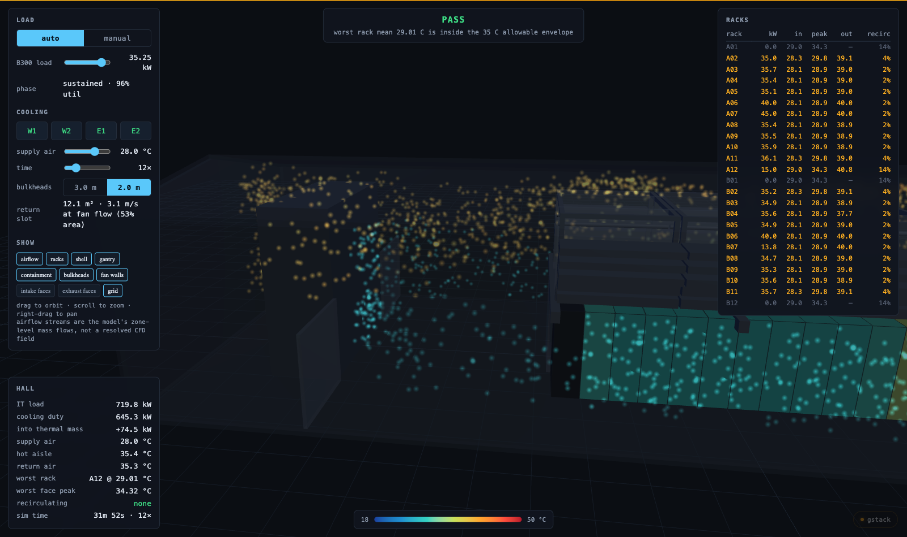
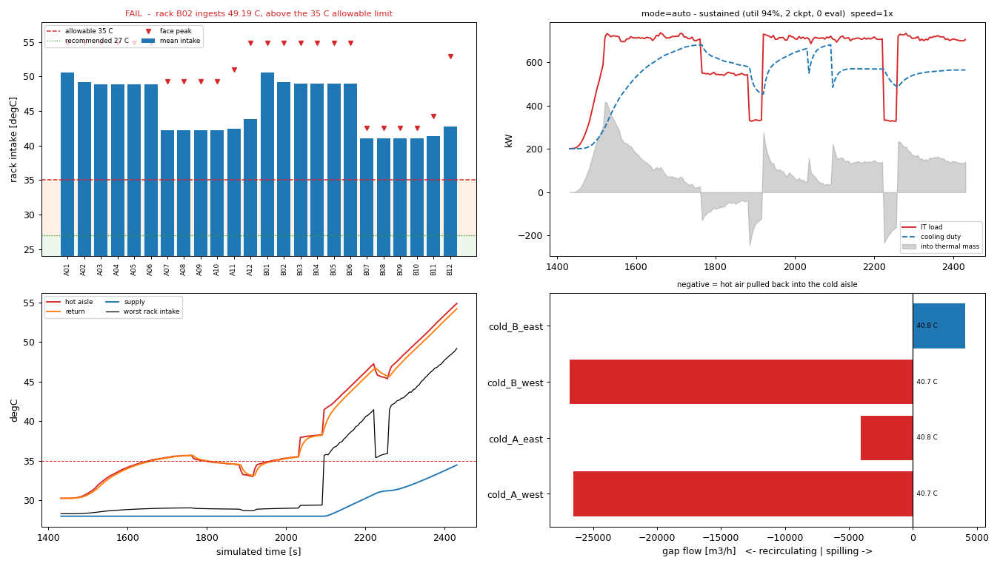

# AU01 digital twin — real-time hall thermals

A lightweight physics model of the AU01 data hall, calibrated against the
OpenFOAM CFD in `../cfd-cabinet-cooling`, running faster than real time and
streaming its state for an Unreal Engine scene to render.

Two modes drive the high-density B300 racks:

- **manual** — you set the load
- **auto** — a synthetic transformer training run: ramp, sustained grind,
  checkpoint dips, eval pauses, stragglers and restarts

**Live: <https://au01-twin.dametech.net/>** — each visitor gets their own hall.

Locally:

```bash
pip install -e '.[dev]'              # runtime is just numpy + websockets
python3 viewer/prepare_geometry.py   # once: pack the AU01 geometry
dthall run                           # http://127.0.0.1:8765/ — viewer, /ws, /healthz
```



Orbit the hall, watch cold air stream into the cabinet fronts and hot air leave
the open-top aisle, trip a fan wall module and watch the recirculation reverse.
Cabinets are shaded as a vertical gradient from mean intake at the floor to worst
face peak at the top, because in this hall the hot spots are a top-of-rack
phenomenon and a flat colour hides the thing that decides the verdict.

Other entry points:

```bash
dthall validate             # score the model against the CFD
dthall debugview            # 2D dashboard with time traces (needs `dthall run`)
dthall replay --script scenarios/west_fanwall_trip.json
```



This work stream is **fully isolated** from the CFD. It reads
`cfd-cabinet-cooling/` — geometry, calibration data, result tables — and never
writes to it.

## Why a reduced-order model

The CFD answers design questions in minutes-to-hours per operating point, and
only at steady state. A twin needs an answer every 100 ms, and needs to show what
happens *while* the hall responds. So the CFD's converged results are used to
calibrate a lumped thermal/airflow network — 58 states, sub-millisecond per step,
~400× faster than real time — that reproduces the CFD at the point it was fitted
to and behaves plausibly when you move away from it.

The physics it has to get right is one thing, from
`cfd-cabinet-cooling/RESULTS.md`:

> Racks move their own airflow regardless of what the fan wall delivers, and any
> shortfall is made up by pulling hot exhaust back over the containment. The
> verdict flips exactly where the containment gap flow crosses zero.

AU01's hot aisle is open-topped, so that is not a leak around imperfect panels —
it is the design's intended return path, and the airflow balance is the whole
question. `gap.py` is that closure, and it is the model's centre of gravity.

## Layout

```
digital-twin/
├── rom/dthall/            the model and the service
│   ├── topology.py        node graph, from cfd_export_params.json or hallParameters
│   ├── gap.py             containment-gap recirculation — the governing law
│   ├── rackfan.py         rack airflow from load
│   ├── model.py           ODEs, RK2 integrator, ASHRAE verdict
│   ├── params.py          calibration coefficients (+ params_calibrated.json)
│   ├── calibrate.py       least-squares fit + the validation gate
│   ├── cfddata.py         reads case-hall/postProcessing (windowed, never last-value)
│   ├── profiles.py        auto mode: the training-run generator
│   ├── sim.py             mode control, command queue, stepping
│   ├── telemetry.py       the wire schema
│   ├── server.py          WebSocket service
│   ├── replay.py          headless scripted scenarios -> CSV
│   ├── debugview.py       live matplotlib dashboard
│   └── cli.py             dthall
├── rom/tests/             111 tests
├── deploy/                t4g.small + Caddy: up.sh, provision.sh, deploy.sh, down.sh
├── viewer/                real-time 3D browser viewer (three.js, vendored)
│   ├── prepare_geometry.py packs the CFD STLs -> one binary + manifest
│   ├── app.js             scene, airflow streams, HUD
│   └── geometry/          generated bundle
├── fields/                bake CFD slices -> textures Unreal can remap live
├── ue-export/             FreeCAD -> glTF with names preserved
├── scenarios/             replayable scenarios
├── tools/                 headless dashboard snapshots
└── docs/
    ├── ROM.md             equations, calibration, validation, limits
    ├── ../DEPLOY-PLAN.md  how it is published, and what deploying taught us
    ├── TELEMETRY.md       wire schema reference
    └── UE-SETUP.md        Unreal install + import + scene runbook
```

## The two halls

`topology.py` builds a node graph from either CFD case:

| | `AU01` (default) | `case-hall` |
|---|---|---|
| source | `CFD_Export_RevE/cfd_export_params.json` | `case-hall/system/hallParameters` |
| geometry | as-built room, open-top hot aisle | parametric, contained aisle + ceiling plenum |
| load | Concept-A schedule, 741.8 kW air | uniform 24 × 36 kW = 864 kW |
| rack names | `A01`…`B12` | `rA00`…`rB11` (the CFD function-object tags) |
| role | **what the twin runs** | **what the model is calibrated against** |

`case-hall` uses the CFD's own channel names so calibration joins on them with no
translation layer. `dthall info --hall case-hall` prints either.

## Verification

```bash
PYTHONPATH=rom python3 -m pytest rom/tests -q      # 111 tests, ~50 s
dthall validate                                     # the CFD gate
dthall replay --script scenarios/west_fanwall_trip.json --out runs/trip.csv
python3 tools/snapshot_debugview.py --scenario scenarios/west_fanwall_trip.json
```

The validation gate holds the model to the CFD's 24-rack table: every rack's mean
intake within **0.21 K**, flows within 0.0%, energy closing to 0.00%. Details and
the honest scope of that claim are in [docs/ROM.md](docs/ROM.md).

Energy closes to machine precision at *every* timestep, not just at equilibrium,
because the frame carries the thermal-storage term:
`it_kw = cooling_kw + storage_kw`.

## Scope limits

Stated plainly, because a twin that looks convincing is easy to over-trust:

- **Calibrated at one CFD operating point.** It reproduces that point to 0.21 K.
  Its response to *changes* rests on physics plus priors. `supply_reach` and
  `zone_coupling` — which govern every N-1 answer — are not identifiable from the
  available data. One extra CFD run (`unitsOff A1`, boundary-condition-only, same
  mesh, ~$1 of spot time) would fix that; it is the top item in
  [docs/ROM.md](docs/ROM.md#next-cfd-runs-in-value-order).
- **Transient time constants are engineering estimates.** Steady CFD carries no
  information about them. The shape is physical; the exact seconds are judgement.
- **Air-side only.** The B300 racks also reject ~68 kW each to liquid. None of
  that is modelled — `design_kw` is the air fraction (36.75 kW).
- **One field basis.** Baked slice textures scale and slide with model state but
  cannot change shape, and a module tripping genuinely reorganises the flow field.
- **Coil capacity is a hard cap**, so capacity-limited scenarios are pessimistic.
- **Four cold zones** — enough to make a single module trip asymmetric, not enough
  to resolve a gradient along a row.
- **Each visitor gets an isolated twin**, so there is no shared authority to
  arbitrate — but equally, nothing is persisted: a deploy or a reload starts a
  fresh hall.
- **The published URL has no authentication**, and it exposes the AU01 rack
  schedule, loads, geometry and thermal performance. A deliberate choice; adding a
  password is one Caddyfile block.

## Status

| Milestone | State |
|---|---|
| 1. ROM core | done — 58 states, energy/mass closure under test |
| 2. Calibration + validation gate | done — full gate passing, regression-tested |
| 3. Service, telemetry, debug view, manual mode | done — WebSocket round-trip tested |
| 4. Auto mode + baked fields | done — 6 textures baked, 0.035 K mean error vs raw CFD |
| 4b. Browser 3D viewer | done — geometry, airflow streams, live HUD |
| 4c. Published to AWS | done — https://au01-twin.dametech.net, per-session twins |
| 5. UE install + geometry import | **not started** — needs Unreal installed; runbook in docs/UE-SETUP.md |
| 6. UE live binding | not started |
| 7. Niagara / field planes / polish | not started |

Milestones 5–7 need Unreal installed, which is a GUI/licence step. The browser
viewer (4b) was added so the 3D airflow is inspectable now without it, and it
doubles as a working reference client for `docs/TELEMETRY.md` — the Unreal scene
consumes the identical protocol.

### Airflow visualisation is a schematic, not a field

The streams are path-following particles routed through the real geometry (each
rack's actual intake and exhaust faces, the fan wall discharge faces, over the
bulkheads and down the rear corridor) with speed and colour driven by the model's
zone-level mass flows. They are honest about how much air goes where, at what
temperature, and in which direction. They do not resolve eddies, and the split
between air leaving the open-top aisle upward versus through the baffled channel
ends is a stated assumption in `viewer/app.js`, not a result — no CFD of the AU01
open-top scheme has been run.
